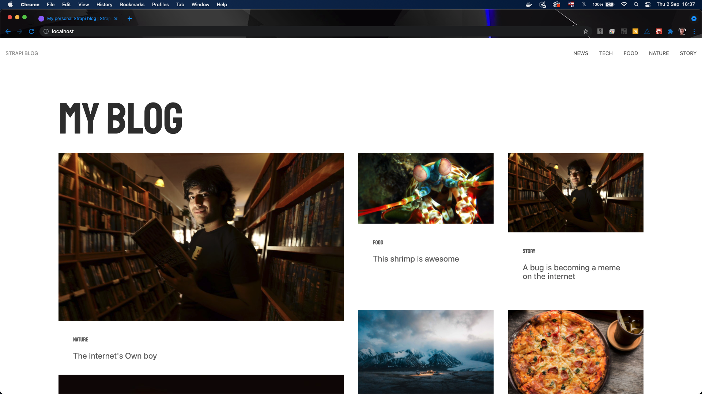

<h1 align="center">
  
</h1>

  

 

 

  

## ✨ Tecnologias

Esse projeto foi desenvolvido com as seguintes tecnologias:

- [React](https://reactjs.org)
- [NextJs](https://nextjs.org/)
- [Strapi](https://strapi.io/)
- [create-next-app](https://nextjs.org/docs/api-reference/create-next-app)
- [TypeScript](https://www.typescriptlang.org/)

## 💻 Projeto

Exemplo de projeto docker-compose com front-end em Next.js, back-end em strapi e mongodb.

## 🚀 Como executar

- Clone o repositório
- Inicie com `docker-compose up`

Acessar o front-end [`localhost`](http://localhost) do seu navegador.
Acessar o back-end [`localhost`](http://localhost:1337) do seu navegador.

## 📄 Licença

Esse projeto está sob a licença MIT. Veja o arquivo [LICENSE](LICENSE.md) para mais detalhes.

---

Feito com ♥ by Yuri Brasil 👋🏻